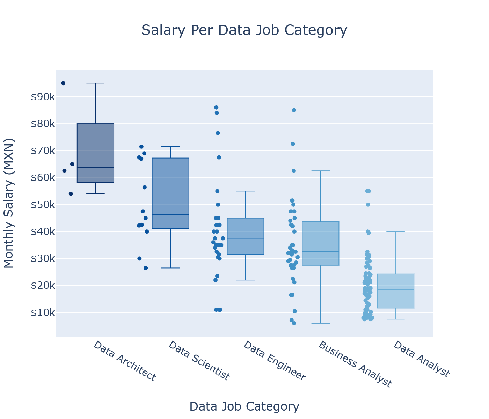

<p align="center">
	
</p>


# Data Jobs Salaries in Mexico in August 2022
#### By Daniel Eduardo López

**[LinkedIn](https://www.linkedin.com/in/daniel-eduardo-lopez)**

**[Github](https://github.com/DanielEduardoLopez)**

____
### **1. Introduction**
With the emergence of the big data, new jobs have appeared demanding new sets of skills and expertise for extracting value from data (Axis Talent, 2020):

- Business Analysts (BA)
- Data Analysts (DA)
- Data Architects (DR) 
- Data Engineers (DE) 
- Data Scientists (DS)

Which one is the most valued in the Mexican labor market currently?

____
### **2. General Objective**
To identify which data job category has the highest salary in the Mexican labor market in August 2022 according to the OCC website.
____
### **3. Research Question**
Which data job category has the highest salary in the Mexican labor market in August 2022 according to the OCC website?
____
### **4. Hypothesis**
The **Data Scientist** position has the highest salary in the Mexican labor market in August 2022 according to the OCC website.
____
### **5. Abridged Methodology**
The methodology of the present study is based on Rollin’s Foundational Methodology for Data Science (Rollins, 2015).

1) **Analytical approach**: Descriptive and inferential statistics.
2) **Data requirements**: Data about job positions such as job name, salary, employer and location.
3) **Data collection**: Data was collected from the OCC Website (Mexico) on 03 August 2022, through web scraping with Python 3 and its libraries Selenium and BeautifulSoup.
4) **Data exploration and preparation**: Data then was explored and cleaned with Python 3 and its libraries Pandas and Numpy. 
5) **Data analysis**: Data was analyzed with Python 3 and its libraries Pandas, Scipy and Statsmodels and visualized with Matplotlib, Seaborn, Folium and Plotly. 
6) **Statistical analysis**: The D'Agostino-Pearson normality test was used to assess the normality of the data jobs salary distribution. Then, both parametric (ANOVA and t-test with unequal variance) and non-parametric (Mann-Whitney U and Kruskal-Wallis H) tests were carried out to assess the significance of the obtained results.

Furthermore:

7) A **dashboard** was built with Python 3 and its libraries Plotly and Dash.
8) A **final report** was written with the complete results obtained from the data.
9) Some **slides** were prepared with the **most important insights** from the report.

___
### **6. Main Results**
From the sample of 444 data jobs retrieved, the most demanded data job category was **Data Analyst**, with 36% of the total demand of data jobs in Mexico at the time of this study. On the contrary, **Data Architect** positions are the less demanded, with only a 3% out of the total.

<p align="center">
	
</p>

On the other hand, the data jobs demand is highly concentrated in Mexico City (“**Ciudad de México**”, in Spanish) with about the 60% of the total national demand of data jobs. Then, **Nuevo León** and **Estado de México** represent a distant second place with about the 13% of the demand each. Finally, **Jalisco** and **Querétaro** accounts for about the 5% and 4% of the demand, respectively; while the rest of the country is lagging in terms of data jobs creation. 

<p align="center">
	
</p>

**Data Analyst** position is the one most demanded across the Mexican states along with **Data Engineer** and **Business Analyst** positions, whereas **Data Architect** and **Data Scientist** positions are highly concentrated in Ciudad de México and Nuevo León.

<p align="center">
	
</p>

**Banamex** is nowadays the biggest seeker of data skills in the Mexican labor market, along with **Softtek**, and **Grupo Salinas**. 

<p align="center">
	
</p>

Moreover, **Business Analyst**, **Data Engineer**, and **Data Analyst** positions are more demanded across different organizations. On the contrary, **Data Scientist** and, certainly, **Data Architect** vacancies are more likely to be found in tech companies (Digitalability, Gtim Software Projects, Indra, Softek, Uvi Tech, etc.) and banks (Banamex, Banorte, BBVA Bancomer).

<p align="center">
	
</p>

As expectable, most of the companies are located in **Ciudad de México** as the large majority of the vacancies are offered there. However, the following heatmap shows that there are some organizations that spread across several Mexican states such as Banamex, Pepsico, Softek, Sygno and Teleperformance; and there are a few well-known companies whose data jobs demand is not located in the capital region, such as IBM (Jalisco), Johnson Controls (Nuevo León) and Tecnológico de Monterrey (Nuevo León).

<p align="center">
	
</p>

Overall, the average salary of the data jobs in Mexico in August 2022 was **31,179.34 MXN (SD = 18,589.32)** per month. 

<p align="center">
	
</p>

A normality assumption could not be hold as the D'Agostino-Pearson normality test indicated that the null hypothesis that the sample comes from a normal distribution must be rejected at a signification level of $\alpha$ = 0.05 (*p*-value < 0.001).

Notwithstanding with the above, for the purposes of the present study, both parametric (ANOVA and t-test with unequal variance) and non-parametric (Mann-Whitney U and Kruskal-Wallis H) tests were carried out to assess the significance of the obtained results.

The salaries for each data job category are shown in the following box plot:

<p align="center">
	
</p>

The figure above suggests that, after removing the outliers, the average salaries for the different data jobs categories are:

Data Job Category | Average Monthly Salary (MXN)
---|---
Data Architect | $63,750 
Data Scientist | $46,250
Data Engineer | $37,500 
Business Analyst | $32,500
Data Analyst | $18,400 

A further one-way analysis of variance (ANOVA) procedure and a Kruskal-Wallis H test confirmed that the salary differences among the data jobs categories were statistically significant at a signification level of $\alpha$ = 0.05 (*p*-value < 0.001 in both tests).

Then, a series of pairwise t-tests with unequal variance and Mann-Whitney U tests were performed to determine whether the average salary for different data jobs categories was significantly different, indicating that the Data Architect's salaries are not significantly higher than those for Data Scientists at a signification level of $\alpha$ = 0.05 (*p*-value > 0.05). On the other hand, the salary differences among the other data jobs categories were statistically significant at the same signification level.

Thus, according to the results from the present statistical analysis, average salaries for Data Architects and Data Scientists are the highest ones in the current Mexican labor market.

Furthermore, the highest salaries can be found in Ciudad de México, Estado de México, Nuevo León, Querétaro and Quintana Roo. However, the observation for the latter state is atypical and should be interpreted with caution.

<p align="center">
	
</p>

Overall, from the top locations, the average monthly salary for all data jobs categories is higher in **Ciudad de México** (43,559 MXN) and lower in **Nuevo León** (33,366 MXN). 

<p align="center">
	
</p>

The companies offering the highest salaries are **Zegovia RH, Noralogic and Trinity Rail de México**. However, in the case of Zegovia RH, it is reasonable to think that their highly paid data job positions are demanded on behalf of other companies.

<p align="center">
	
</p>

Finally, for **Business Analyst** positions, the organizations offering higher salaries are The Brick Soluciones and Nityo Infotech; for **Data Analyst** positions, the organizations offering higher salaries are Atento Servicios and P3 Impulsores Estratégicos; for **Data Architect** positions, the organizations offering higher salaries are Zegovia RH and Smart Payments; for **Data Engineer** positions, the organizations offering higher salaries are Noralogic and Trinity Rail; and for **Data Scientist** positions, the organizations offering higher salaries are Indra, Axented, Servicios Enki and Talento Hatchers.

<p align="center">
	
</p>

Please refer to the **[Complete Report](https://github.com/DanielEduardoLopez/DataJobsMX2022/blob/main/Report.pdf)** for the full results and discussion.

___
### **7. Dashboard**
To view and play with the interactive Dashboard, please download the **[app](https://github.com/DanielEduardoLopez/DataJobsMX2022/blob/main/4-Dashboard.py)** into a directory of your choice. Then, run the app using the following command in Windows:
```bash
python 4-Dashboard.py
```
And visit http://127.0.0.1:8050/ in your web browser.

<p align="center">
	
</p>

Please note that Python 3 and its libraries Numpy, Pandas, Dash and Plotly are required for properly running the dashboard.

___
### **8. Conclusions**
**Data Architect** and **Data Scientist** are the data job categories with the highest salaries in the Mexican labor market in August 2022 according to the OCC website. Thus, the present study's hypothesis is rejected.

On the contrary, **Data Analyst** is the data job category more demanded in the current Mexican labor market and across the different Mexican states, even though it was also the one with the lowest salary.

**Ciudad de México** is the place where it is possible to find the highest jobs demand and the highest salaries. 

**Data Analyst**, **Business Analyst**, and **Data Engineer** positions are more demanded across different type of organizations and locations. Whereas **Data Architect** and **Data Scientist** positions are very concentrated in Ciudad de México, Estado de México and Nuevo León, and are most likely to be found in tech companies and banks.

**Banamex**, **Softtek**, and **Grupo Salinas** exhibit the highest demand of data jobs positions; while **Zegovia RH**, **Noralogic**, and **Trinity Rail de México** offer the highest salaries.

This study had **limitations**: 
- Only used OCC as source of information during a very short period of time (just 03 August 2022). 
- Very few salary observations were retrieved for Data Architect and Data Scientist positions.
- Collected data mostly correspond to Ciudad de México, Estado de México, Nuevo León and Jalisco.
- No distinction was made among entry level, middle and senior positions. 

**Future perspectives**:
- Gather data from more job websites.
- Retrieve information for a longer time span.
- Collect more salary observations for Data Architect and Data Scientist positions.
- Collect more salary data for other Mexican states.
- Make a distinction among entry level, middle and senior positions.

___
### **9. Partial Bibliography**
- **Axis Talent. (2020).** *The Ecosystem of Data Jobs - Making sense of the Data Job Market*. Retrieved from Axis Talent: https://www.axistalent.io/blog/the-ecosystem-of-data-jobs-making-sense-of-the-data-job-market
- **Rollins, J. B. (2015).** *Metodología Fundamental para la Ciencia de Datos*. Somers: IBM Corporation. Retrieved from https://www.ibm.com/downloads/cas/WKK9DX51

___
### **10. Description of Files in Repository**
File | Description 
--- | --- 
1-DataCollection.ipynb | Notebook with the Python code for collecting the required data from the OCC website.
2-DataWrangling.ipynb | Notebook with the Python code for cleaning and preparing the data retrieved through web scraping.
3-DataAnalysisViz.ipynb | Notebook with the Python code for analyzing and visualizing the data.
4-Dashboard.py | Dash app for rendering the interactive dashboard.
Dataset_Clean.csv | CSV file with the cleaned job data  (Job, Company, Location, Average Salary).
Dataset_Raw.csv | CSV file with the raw data collected through web scraping (Job, Salary, Company, Location).
Report.pdf | Complete report with the results obtained from the data.
Slides.pdf | Slides with the most important insights gained from the data analysis.
